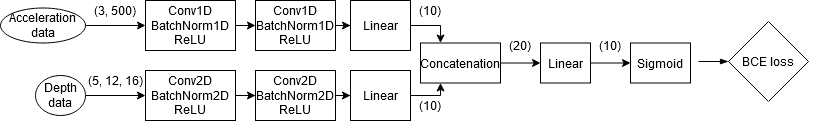

# mmdf-course-project

This project studies multi-modal data fusion techniques using MEx dataset from UCI machine learning repository. 
The idea is to apply different techniques to recognize physical exercises from wearable sensors and depth camera, user-independently.

